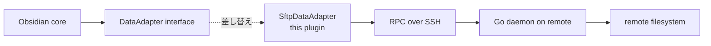
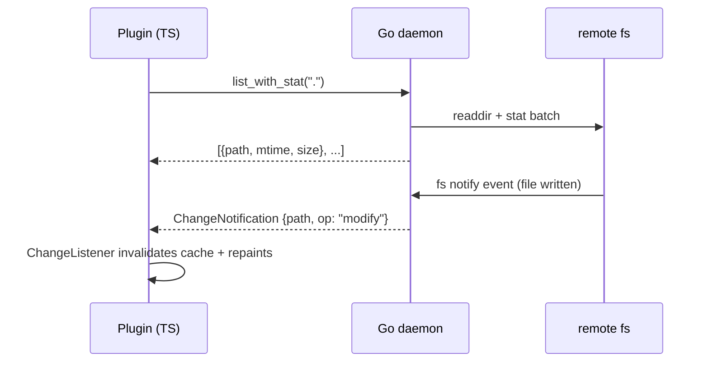

## はじめに

前回 [Obsidian の vault を SSH リモートで直接編集できるプラグインを作った](https://zenn.dev/sotashimozono/articles/obsidian-remote-ssh-introduction) で紹介した [obsidian-remote-ssh](https://github.com/sotashimozono/obsidian-remote-ssh) の内部設計の話です。

「ローカルに replica を作らずに Obsidian で SSH 越しの vault を扱う」を成立させるには、Obsidian 内部の vault 抽象 (Vault adapter) を **そのまま SSH/RPC で代替する** 必要があります。本記事ではその実装方針と、Obsidian の特殊事情によって選んだいくつかの非自明な決定について書きます。

主な話題:

1. Vault adapter とは何か、なぜそこに入ったか
2. **shadow vault** — 別 Electron プロセスを立てる理由
3. ローカル plugin (TypeScript) ↔ リモート daemon (Go) の RPC 設計
4. `fs.watch` → ChangeListener → File Explorer 再描画の chain
5. 性能 — SFTP より RPC を選んだ理由
6. workspace.json は per-client subtree に閉じ込める

## 1. Vault adapter — Obsidian の I/O 抽象層

Obsidian の `App.vault.adapter` は、vault 内の全ファイル I/O が通る単一の interface です。`read` / `write` / `list` / `stat` / `mkdir` / `remove` / `rename` の 7 オペレーションでだいたい全部表現できる、ファイルシステム抽象。

公式に export されてはいませんが、TypeScript 上では:

```typescript
interface DataAdapter {
  read(path: string): Promise<string>;
  readBinary(path: string): Promise<ArrayBuffer>;
  write(path: string, data: string): Promise<void>;
  writeBinary(path: string, data: ArrayBuffer): Promise<void>;
  list(path: string): Promise<ListedFiles>;
  stat(path: string): Promise<Stat | null>;
  mkdir(path: string): Promise<void>;
  remove(path: string): Promise<void>;
  rename(oldPath: string, newPath: string): Promise<void>;
}
```

このインターフェイスを **SSH/RPC を喋る別実装に差し替えれば**、Obsidian の上位の機能 (file explorer, Dataview, Canvas, Graph, …) は全部そのまま動きます。これが本プラグインの中核アイディアです。

つまりやりたいことは:



これだけ言うと簡単に聞こえます。が、Obsidian は **vault adapter を実行時に差し替える API を提供していません**。`App.vault.adapter` は vault open 時に決定し、以降固定です。

## 2. Shadow vault — なぜ別 Electron プロセスを立てるか

そこで本プラグインが採るアプローチが **shadow vault** です。

> プラグインは、リモート profile に対応する **新しい vault ディレクトリをローカルに用意し**、そこに「`obsidian-remote-ssh` プラグインだけが有効化された状態」を bootstrap する。次に `obsidian://open?path=...` URL scheme を fire することで、Obsidian の **新規 BrowserWindow** をその shadow vault 上で開かせる。

shadow vault 側の plugin onload は、起動時に「自分は shadow vault だ」というマーカーを `data.json` で検出し、対応する SSH profile に **auto-connect** します。connect が完了したタイミングで、**Vault adapter を差し替える** モンキーパッチを当てます。

```typescript
// 概念コード
async onload() {
  if (this.settings.autoConnectProfileId) {
    await this.connectToProfile(this.settings.autoConnectProfileId);
    // ↓ ここで app.vault.adapter を差し替える
    this.adapterManager.swapToRemote(this.app.vault, this.sftpAdapter);
  }
}
```

差し替えた瞬間から、Obsidian core が `vault.read()` を呼ぶたびに RPC が飛んで、リモートのファイル内容が返ります。File Explorer が並べるエントリも、Canvas がバックリンクを解決するときも、Templater がテンプレを読むときも、全部 RPC 経由で動作します。

### なぜ「同じ Obsidian window で adapter を差し替える」 ではなく「新しい window を開く」 のか

Obsidian の adapter swap は、vault の lifetime 内では基本的にサポートされていません。実際にやろうとすると、進行中の reads / writes / file watchers の整合性を取るのが極めて難しい。「**vault open 時に adapter を決定**」という Obsidian の不変条件を破ると、core 側のキャッシュ (Markdown indexer, Graph, etc.) が腐ります。

なので **shadow vault という別 vault を立てて、そこに最初から RPC adapter で開かせる** という回避策に倒しました。これは VS Code Remote-SSH が「リモート用の VS Code window を別 process で立ち上げる」のと精神的に同じです。

副産物として:

- ローカル vault と shadow vault が **物理的に別 window** なので、ユーザは両方を同時に開ける
- shadow vault が落ちてもローカル vault は無傷

## 3. ローカル plugin ↔ リモート daemon の RPC

リモート側には Go で書いた daemon (`server/`) を SSH で起動します。SSH 接続が成立すると plugin が `~/.obsidian-remote-ssh/server` に scp して `exec` する仕組みです。

Daemon を Go にした理由:

- 静的バイナリで持ち込みやすい
- リモート side の依存ゼロ (Python や Node を要求しない)
- `fsnotify` で `inotify` / `kqueue` / `FSEvents` を 1 つの API で扱える
- 並行 IO が cheap

### RPC vs SFTP

SFTP でも `read` / `write` / `list` は完結します。実際初期 prototype は SFTP-only でした。が、以下が SFTP では辛い:

- **stat の batch**: Obsidian core は file explorer を描画するために `list` した直後 各ファイルの `stat` を呼びます。SFTP では 1 file 1 RTT なのでゆうに 100ms+ 遅延。RPC なら `list_with_stat` を 1 RTT で返せる
- **fs.watch 相当**: SFTP には push 通知の概念が無く、ポーリングするしかない。プラグインから 5 秒おきに `list` を打つと帯域が無駄
- **resource bridge**: 大きい画像 (PNG, PDF) を Obsidian の `` タグで表示させるとき、`app://` URL から ranged read を要求される。SFTP の `readFile` は range 取れない / 遅い

なので daemon 側で:

- **server-side push channel** で fs.watch 通知
- `list_with_stat` の batch read
- `read_range(path, offset, length)` で resource bridge 用の partial fetch

を実装しています。protocol は JSON-RPC over single multiplexed channel (SSH の direct-tcpip)。



## 4. fs.watch → reflect chain

リモート側で誰かが (e.g. 計算ジョブが) ファイルを書いた瞬間、ローカル Obsidian の File Explorer に反映されることを保証したいです。

chain:

1. Daemon の `fsnotify` が write イベント検知
2. Daemon → Plugin に `ChangeNotification` push
3. Plugin の `ChangeListener` が adapter のローカルキャッシュを invalidate
4. Obsidian core の `Vault` に `modify` event を fire
5. File Explorer / Backlinks / Graph が repaint

E2E test (`reflect.spec.ts`) はこの chain を **end-to-end で検証** しています。SFTP でリモートにファイルを書いて、`REFLECT_TIMEOUT_MS = 15s` 内に File Explorer に現れることを assert する形。

## 5. workspace.json と per-client subtree

`<vault>/.obsidian/workspace.json` は Obsidian がローカル状態 (どの pane がどこに開いてるか、最近開いたファイル等) を保存するファイルです。

これを **共有 vault に書くと**、機械 A が pane を分割した瞬間に機械 B の Obsidian にも反映されてしまい、お互いの作業面が壊れます。

なので path mapper で:

```text
<vault>/.obsidian/workspace.json   ← 機械から見た仮想パス
↓ (read/write 時にリダイレクト)
<vault>/.obsidian/user/<client_id>/workspace.json   ← 実ファイル
```

という per-client subtree への redirect を入れています。Obsidian core は workspace.json を読んでるつもりが、実際は client-local な subtree。複数マシンが同じ vault に同時接続しても layout は独立に保たれます。

## まとめ

- Obsidian の vault adapter を **swap-in 不可能** という制約から、shadow vault という別 Electron window を立てる回避策を採った
- adapter は SFTP よりも独自 RPC over SSH を選択 — `list_with_stat` の batch、`fs.watch` の push、`read_range` の resource bridge が必要だったため
- `workspace.json` 等の client-local state は path mapper で per-client subtree に redirect

次回は研究者の実 workflow にこのプラグインをどう組み込むか — 計算機ジョブの結果を Obsidian で構造化する方法 — について書く予定です。
