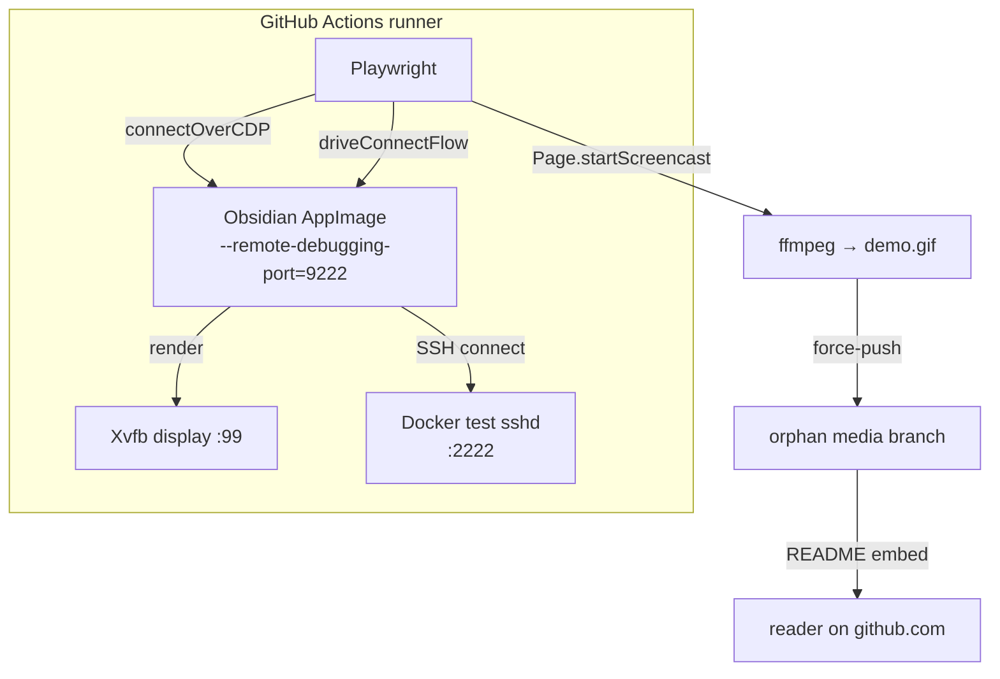

## はじめに

これまで [紹介](https://zenn.dev/sotashimozono/articles/obsidian-remote-ssh-introduction) / [内部設計](https://zenn.dev/sotashimozono/articles/obsidian-remote-ssh-architecture) / [研究 workflow](https://zenn.dev/sotashimozono/articles/obsidian-remote-ssh-research-workflow) について書いてきた [obsidian-remote-ssh](https://github.com/sotashimozono/obsidian-remote-ssh) シリーズの最終回です。

今回は本プラグインの E2E テストの話です — Obsidian (Electron アプリ) 上で動作するプラグインを Playwright で end-to-end 検証し、ついでに README 用のデモ GIF まで自動生成する方法。

書く動機: Obsidian / Electron 系の E2E は資料がほぼ無い。Web の Playwright 記事は山ほどあるんですが、`chromium.connectOverCDP` で Electron に attach する話、shadow window を捕まえる話、CDP `Page.startScreencast` で GIF を作る話、どれも繋がった記事が見つからなかった。同じ問題に当たる人のために残します。

おまけ: 「fake-green」 (E2E が CI 上で落ちてないように見えて実は何も走ってない) を発見したときの話も書きます。

## 全体像

最終的にこういう構成になっています:



全体は単一の GitHub Actions workflow `demo-capture.yml` (manual dispatch) に閉じてます。

## 1. Electron に Playwright をくっつける

Obsidian は Electron 製。普通の Playwright `chromium.launch()` ではなく、既存プロセスに後付けで attach する必要があります。

```yaml
# demo-capture.yml の抜粋
- name: Run demo walkthrough
  env:
    OBSIDIAN_PATH: ~/obsidian/squashfs-root/obsidian
    DISPLAY: ':99'
  run: npx playwright test --config e2e/playwright.config.ts demo.spec.ts
```

```typescript
// helpers/obsidian.ts
const proc = spawn(obsidianBin, [
  `--remote-debugging-port=${CDP_PORT}`,  // ←ここで CDP を開ける
  '--no-sandbox',
], { stdio: 'pipe' });

await waitForCDP(`http://127.0.0.1:${CDP_PORT}`, 30_000);
const browser = await chromium.connectOverCDP(`http://127.0.0.1:${CDP_PORT}`);
const page = browser.contexts()[0].pages()[0];
```

ここまでで Playwright がリモート Chromium を握った状態。`page.locator('.workspace')` が普通に効く。

## 2. Restricted Mode と community plugins

新規 vault を Obsidian で開くと **Restricted Mode** に入ります。コミュニティプラグインは無効化されており、ユーザが「Trust author and enable plugins」を手動でクリックするまで動きません。

CI ではクリックする人間がいないので、`app.plugins` API を直叩きします:

```typescript
await page.evaluate(async (id) => {
  const app = (window as any).app;
  if (app.plugins.isEnabled && !app.plugins.isEnabled()) {
    await app.plugins.setEnable(true);  // restricted mode 解除
  }
  if (!app.plugins.plugins[id]) {
    await app.plugins.enablePluginAndSave(id);  // 自分のプラグインを load
  }
}, 'remote-ssh');
```

そして「ロード完了」を確実に待つ:

```typescript
await page.waitForFunction(
  (id) => {
    const app = (globalThis as any).app;
    const instance = app?.plugins?.plugins?.[id];
    const cmds = app?.commands?.commands;
    if (!instance || !cmds) return false;
    // commands に <id>:* があれば actually onload した
    return Object.keys(cmds).some((k) => k.startsWith(`${id}:`));
  },
  'remote-ssh',
  { timeout: 30_000 }
);
```

`enabledPlugins.has(id)` を見ると意図しか確認できない (community-plugins.json に載った瞬間 true)。実 `onload()` が走ったかどうかは commands の登録を見るのが確実、というのが教訓。

## 3. Shadow window の捕まえ方

このプラグインは connect 成功時に新しい Electron BrowserWindow を立ち上げます (前回の architecture 記事参照)。問題は新 window が同じ CDP debugging port に出てこないこと。Obsidian は vault isolation のために shadow vault を別 process で起動するので、`browser.contexts()` は片方しか見えません。

回避策: `~/.config/obsidian/obsidian.json` を polling して、scaffold じゃない vault エントリが出現したら、original Obsidian を kill して shadow vault path で再起動する:

```typescript
export async function findShadowVaultPath(
  scaffoldVaultPath: string,
  timeoutMs: number,
): Promise<string> {
  const obsidianConfigPath = path.join(
    process.env.HOME!, '.config', 'obsidian', 'obsidian.json',
  );
  const deadline = Date.now() + timeoutMs;
  while (Date.now() < deadline) {
    const cfg = JSON.parse(fs.readFileSync(obsidianConfigPath, 'utf8'));
    let bestTs = -1;
    let shadowPath: string | null = null;
    for (const id of Object.keys(cfg.vaults ?? {})) {
      const e = cfg.vaults[id];
      if (!e?.path || e.path === scaffoldVaultPath) continue;
      if (!fs.existsSync(e.path)) continue;
      if ((e.ts ?? 0) > bestTs) {
        bestTs = e.ts;
        shadowPath = e.path;
      }
    }
    if (shadowPath) return shadowPath;
    await new Promise((r) => setTimeout(r, 500));
  }
  throw new Error('connect command never registered shadow vault');
}
```

`fs.existsSync` でハマったポイント: spec 横断で obsidian.json が累積して、過去 spec の削除済み scaffold path を引いてしまう事故が起きる。実在チェック必須。`ts` の最大値を採るのも保険。

## 4. CDP `Page.startScreencast` で GIF を作る

ここが今回一番面白いところ。

最初は `ffmpeg -f x11grab` で Xvfb の画面を録画する方針でした。が、Electron + CDP + Xvfb の組み合わせでは画面が真っ黒にしか録れません (CDP 駆動だと paint が off-screen surface に行くらしい)。

代わりに CDP の `Page.startScreencast` を使うと natural rate でフレームが流れてきます:

```typescript
const session = await page.context().newCDPSession(page);
const frames: Array<{ buf: Buffer; ts: number }> = [];

session.on('Page.screencastFrame' as never, (async (frame: any) => {
  frames.push({ buf: Buffer.from(frame.data, 'base64'), ts: Date.now() });
  await session.send('Page.screencastFrameAck' as never, { sessionId: frame.sessionId } as never);
}) as never);

await session.send('Page.startScreencast' as never, {
  format: 'png',
  quality: 90,
  maxWidth: 1024,
  maxHeight: 800,
  everyNthFrame: 1,
} as never);

// ...操作する...

await session.send('Page.stopScreencast' as never);
```

各フレームに timestamp を付けて保存し、ffmpeg の `concat` demuxer で per-frame duration を制御:

```bash
# concat.txt
file '/path/to/phase1-00000.png'
duration 0.13
file '/path/to/phase1-00001.png'
duration 0.10
...
file '/path/to/phase2-00191.png'   # 最後はもう一回 (concat 仕様)

# ffmpeg
ffmpeg -y -f concat -safe 0 -i concat.txt \
  -vf "fps=10,scale=800:-1:flags=lanczos,palettegen=stats_mode=diff" /tmp/palette.png
ffmpeg -y -f concat -safe 0 -i concat.txt -i /tmp/palette.png \
  -lavfi "fps=10,scale=800:-1:flags=lanczos[x];[x][1:v]paletteuse=dither=bayer:bayer_scale=5:diff_mode=rectangle" \
  -loop 0 /tmp/demo.gif
```

natural-rate のフレーム + 自然な待ち時間で、滑らかな demo GIF が出来上がります。10 fps に resample することでファイルサイズも abuse しない。

最終形 (実物): <https://raw.githubusercontent.com/sotashimozono/obsidian-remote-ssh/media/demo.gif>

## 5. 一番重要な教訓: fake-green を疑え

このシリーズで一番痛かった発見:

> 数日 nightly E2E が "✓ green" になっていたが、実は Obsidian がそもそも boot しておらず、smoke test 5 つ全部が silent skip していた。

原因の連鎖:

1. AppImage の URL が 404
2. `curl -L` (without `-f`) が "Not Found" HTML body を AppImage として保存
3. ↑ が cache されて以降のすべての run も poisoned
4. `--appimage-extract` が失敗するが、`|| true` で suppress
5. 後段の Playwright が `spawn ENOENT` で落ちる
6. しかし `Run E2E smoke tests` step に `continue-on-error: true` が付いていて、workflow は ✓ green
7. 結果として 3 日連続 fake-green

修正:

- nightly cron を per-PR トリガー + paths-filter に変更
- `continue-on-error: true` を削除 → 失敗が本物の status check として現れる
- AppImage download に `-f` 追加 (4xx で fail loud)
- AppImage 検証ステップ追加 (`file ~/obsidian/Obsidian.AppImage | grep ELF`)
- 週次 cron は別 workflow として残し、environment drift を捕捉する sentinel に

教訓: CI が緑だからといって、テストが走っているとは限らない。`continue-on-error: true` を見たら、何のために付いてるか説明できないなら捨てる。

## まとめ

- Electron に Playwright を後付け attach する: `--remote-debugging-port` + `chromium.connectOverCDP`
- community plugins は `app.plugins` API で強制有効化、`commands` 登録で実 load を確認
- Obsidian の shadow window は **kill + relaunch** で別途 attach する戦術
- 画面録画は CDP `Page.startScreencast` が安定。フレーム timestamp を ffmpeg `concat` の `duration` に変換すれば自然な GIF
- `continue-on-error: true` を疑え

このシリーズはこれで一旦終わりです。プラグイン本体は Obsidian Community Store の registry PR ([obsidianmd/obsidian-releases#12390](https://github.com/obsidianmd/obsidian-releases/pull/12390)) が承認されれば直接インストール可能になります。それまでは BRAT 経由でどうぞ。

- GitHub: <https://github.com/sotashimozono/obsidian-remote-ssh>
- Issues / Discussion: <https://github.com/sotashimozono/obsidian-remote-ssh/issues>
- 過去記事: [紹介](https://zenn.dev/sotashimozono/articles/obsidian-remote-ssh-introduction) / [内部設計](https://zenn.dev/sotashimozono/articles/obsidian-remote-ssh-architecture) / [研究 workflow](https://zenn.dev/sotashimozono/articles/obsidian-remote-ssh-research-workflow)
